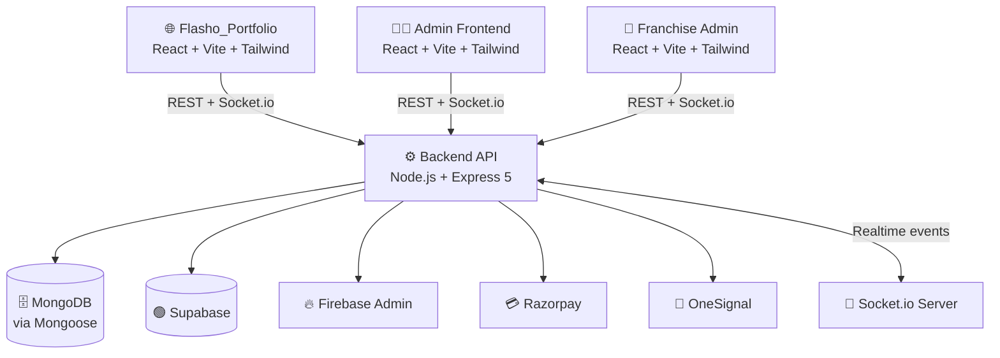

<div align="center">


# ⚡ Flasho

### 🚀 Book trusted service professionals. Anytime, anywhere.

*A technology-powered service marketplace connecting customers with verified agencies for reliable home and office services — transparent pricing, fast booking, trusted pros.*

<br/>

[](https://react.dev/)
[](https://vitejs.dev/)
[](https://tailwindcss.com/)
[](https://nodejs.org/)
[](https://expressjs.com/)
[](https://www.mongodb.com/)
[](https://supabase.com/)
[](https://firebase.google.com/)
[](https://socket.io/)
[](https://razorpay.com/)
[](https://jwt.io/)
[](https://onesignal.com/)
[]()
[]()

<br/>

[✨ Features](#-features) •
[🏗️ Architecture](#️-architecture) •
[🚀 Quick Start](#-quick-start) •
[📂 Modules](#-module-breakdown) •
[📸 Screenshots](#-screenshots)

</div>

---

## 📖 About The Project

**Flasho** is a technology-powered **service marketplace** that connects customers with verified service agencies for reliable home and office services. The platform simplifies service booking, ensures transparent pricing, and delivers fast access to trusted professionals — while creating new business opportunities for service providers.

Under the hood, it's built as a **multi-module monorepo** — instead of cramming everything into one app, the platform is split into four purpose-built pieces that all talk to a shared backend:

- 🌐 A public-facing **portfolio site** to represent the brand
- 🧑‍💼 An internal **admin dashboard** for day-to-day operations
- 🏢 A dedicated **franchise admin panel** for managing multiple franchise locations
- ⚙️ A single **backend API** powering all of the above

> 💡 *This structure makes it easy to scale, deploy, and maintain each part independently — update the franchise panel without touching the public site, deploy the backend on its own schedule, and so on.*

---

## ✨ Features

<table>
<tr>
<td width="50%" valign="top">

### 🌐 Public Portfolio
- Browse verified service agencies
- Transparent, upfront pricing
- Fast, simple service booking flow

</td>
<td width="50%" valign="top">

### 🧑‍💼 Admin Dashboard
- Manage customers, bookings & agencies
- Monitor platform-wide activity
- Role-based access control

</td>
</tr>
<tr>
<td width="50%" valign="top">

### 🏢 Franchise Admin
- Manage service agencies per franchise
- Track bookings & revenue by location
- Onboard new franchise partners

</td>
<td width="50%" valign="top">

### ⚙️ Backend API
- Real-time booking updates via Socket.io
- Secure payments via Razorpay
- Push notifications via OneSignal
- JWT-secured, role-based auth

</td>
</tr>
</table>

---

## 🏗️ Architecture



Each frontend module is decoupled and communicates with the backend exclusively through its REST API and real-time Socket.io channels — keeping concerns separated and deployments independent.

---

## 🧰 Tech Stack

<div align="center">

| Layer | Technology | Notes |
|:---:|:---:|:---|
| 💻 Frontend |    | Fast, modern UI across all three frontend modules |
| 🚀 Backend |   | Core REST API server |
| 🗄️ Database |  | via **Mongoose** ODM |
| ☁️ Backend-as-a-Service |   | Supplementary data/auth services |
| 🔐 Auth |  | Token-based authentication |
| 📡 Realtime |  | Live updates & events |
| 💳 Payments |  | Payment processing |
| 🔔 Notifications |  | Push notifications |

</div>

---

## 🚀 Quick Start

### ✅ Prerequisites

Make sure you have these installed:

- 🟢 [Node.js](https://nodejs.org/) `v18+`
- 📦 npm or yarn
- 🗄️ A [MongoDB](https://www.mongodb.com/) instance (local or Atlas)
- 🟢 A [Supabase](https://supabase.com/) project
- 🔥 A [Firebase](https://firebase.google.com/) project with Admin SDK credentials
- 💳 A [Razorpay](https://razorpay.com/) account (for payments)
- 🔔 A [OneSignal](https://onesignal.com/) account (for push notifications)

### 📥 Clone & Install

```bash
git clone https://github.com/VanshKirtishahi/Flasho.git
cd Flasho
```

Install each module's dependencies:

```bash
# ⚙️ Backend
cd backend && npm install

# 🧑‍💼 Admin frontend
cd "../admin frontend" && npm install

# 🏢 Franchise admin
cd ../franchise_admin && npm install

# 🌐 Portfolio site
cd ../Flasho_Portfolio && npm install
```

### 🔑 Configure Environment

Create a `.env` file inside `backend/`:

```env
PORT=5000
MONGODB_URI=<your-mongodb-connection-string>
JWT_SECRET=<your-jwt-secret-key>

# Supabase
SUPABASE_URL=<your-supabase-url>
SUPABASE_KEY=<your-supabase-key>

# Firebase Admin
FIREBASE_PROJECT_ID=<your-firebase-project-id>
FIREBASE_CLIENT_EMAIL=<your-firebase-client-email>
FIREBASE_PRIVATE_KEY=<your-firebase-private-key>

# Razorpay
RAZORPAY_KEY_ID=<your-razorpay-key-id>
RAZORPAY_KEY_SECRET=<your-razorpay-key-secret>

# OneSignal
ONESIGNAL_APP_ID=<your-onesignal-app-id>
ONESIGNAL_API_KEY=<your-onesignal-api-key>
```

<!-- TODO: confirm exact variable names match your codebase -->

### ▶️ Run It

Open a terminal per module:

```bash
# ⚙️ Backend        →  http://localhost:5000
cd backend && npm start

# 🧑‍💼 Admin frontend →  http://localhost:3000
cd "admin frontend" && npm start

# 🏢 Franchise admin →  http://localhost:3001
cd franchise_admin && npm start

# 🌐 Portfolio site  →  http://localhost:3002
cd Flasho_Portfolio && npm start
```

<!-- TODO: update ports to match your actual configs -->

---

## 📂 Module Breakdown

| Module | Emoji | Purpose | Tech |
|---|:---:|---|---|
| `Flasho_Portfolio` | 🌐 | *Public-facing landing page and customer booking interface. Users can browse categories, view upfront pricing, and schedule services.* | *React, Vite, Tailwind CSS* |
| `admin frontend` | 🧑‍💼 | *Super Admin dashboard for platform owners. Features include global service catalog nesting, KYC document approval, marketing broadcasts, and 1-click financial settlements.* | *React, Vite, Tailwind CSS, Axios, Lucide Icons* |
| `backend` | ⚙️ | *Centralized API engine handling business logic, MongoDB aggregations, JWT verification, RazorpayX webhooks, and Socket.io rooms.* | *Node.js, Express, Mongoose, Socket.io, Cors* |
| `franchise_admin` | 🏢 | *Dedicated portal for agency partners to onboard local professionals, assign active jobs, and track localized revenue metrics.* | *React, Vite, Tailwind CSS, Axios* |

---

## 📸 Screenshots

<!-- TODO: add real screenshots or a demo GIF -->
<div align="center">
<i>Coming soon — drop screenshots or a demo GIF here to make the README pop even more! 🎬</i>
</div>

---

## 📜 License

This project is currently **unlicensed**. <!-- TODO: add a license, e.g. MIT, and link it here -->

---

## 📬 Contact & Credits

<div align="center">

Built with ❤️ and ☕ by **[Vansh Kirti Shahi](https://github.com/VanshKirtishahi)**

[](https://github.com/VanshKirtishahi)

### ⭐ If Flasho helped or inspired you, consider giving it a star!

</div>
